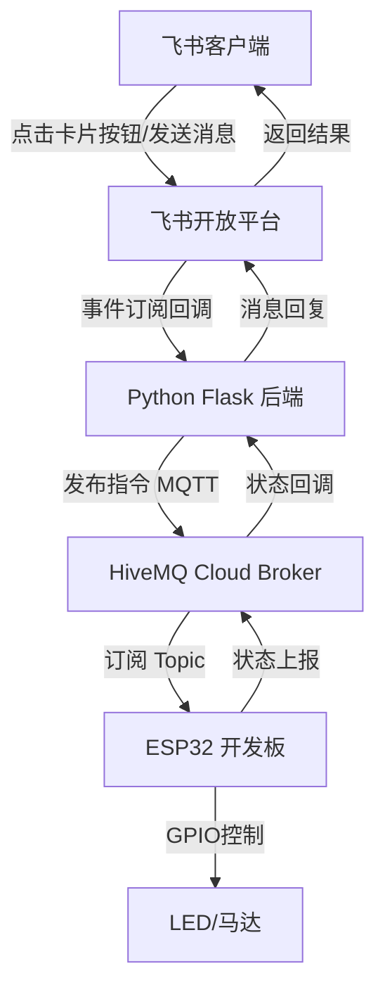

## 用户需求

通过飞书发送指令远程控制 ESP32（Arduino）开发板，实现开灯、关灯、马达左转、马达右转功能。

## 产品概述

搭建一套基于飞书自建应用 + 云 MQTT 中转的物联网控制系统。用户通过飞书对话或卡片按钮发送指令，经过云端后端服务转发至 ESP32 开发板执行。当前阶段先完成软件框架搭建，供后续硬件接入测试。

## 核心功能

- 飞书自建应用接收用户指令（消息或卡片按钮交互）
- Python 后端服务处理飞书事件并发布 MQTT 消息
- 云 MQTT Broker 中转指令（适配内网环境，无需公网 IP）
- ESP32 Arduino 示例代码（WiFi 连接 + MQTT 订阅 + GPIO 控制）
- 指令模拟测试脚本（无硬件时验证流程）

## 技术栈选型

### 后端服务

- **语言**: Python 3.x
- **Web 框架**: Flask（轻量，适合事件接收）
- **MQTT 客户端**: paho-mqtt
- **飞书 SDK**: lark-oapi（飞书官方 Python SDK）

### ESP32 端

- **开发框架**: Arduino Framework
- **WiFi 库**: WiFi.h（ESP32 内置）
- **MQTT 库**: PubSubClient
- **GPIO 控制**: 数字输出控制 LED 和马达方向引脚

### 云服务

- **MQTT Broker**: HiveMQ Cloud 免费版（无需公网 IP，ESP32 只需能访问外网）
- **MQTT Topic 设计**:
- 指令下发: `esp32/control`
- 状态上报: `esp32/status`

## 实现方案

### 系统架构



### 数据流

1. 用户在飞书对话中点击控制卡片按钮（或发送文本指令）
2. 飞书开放平台将事件推送到 Python 后端（事件订阅 URL）
3. Flask 后端解析指令，通过 paho-mqtt 发布到 HiveMQ Cloud
4. ESP32 订阅 `esp32/control` 主题，接收指令
5. ESP32 根据指令控制对应 GPIO 引脚输出高低电平
6. ESP32 可选上报执行状态到 `esp32/status` 主题

## 实现细节

### 目录结构

```
/Users/macmini/WorkBuddy/20260427091743/
├── feishu-app/
│   ├── manifest.json          # [NEW] 飞书自建应用配置（权限、事件订阅等）
│   ├── app_config.py          # [NEW] 应用配置（App ID、App Secret、MQTT配置）
│   ├── server.py              # [NEW] Flask 后端主服务（事件处理 + MQTT发布）
│   ├── feishu_card.py         # [NEW] 飞书交互卡片构建器（控制按钮卡片）
│   └── requirements.txt       # [NEW] Python 依赖列表
├── esp32-code/
│   └── esp32_controller.ino  # [NEW] ESP32 Arduino 代码（WiFi+MQTT+GPIO控制）
├── test/
│   └── test_mqtt_simulator.py # [NEW] MQTT 指令模拟测试脚本（无硬件测试）
└── docs/
    └── 部署说明.md             # [NEW] 完整部署步骤文档
```

### 关键代码结构设计

#### 指令协议定义

```python
# 指令格式（JSON）
{
    "action": "led_on | led_off | motor_left | motor_right",
    "timestamp": 1234567890,
    "source": "feishu"
}
```

#### 飞书卡片结构

- 卡片包含四个操作按钮：开灯、关灯、马达左转、马达右转
- 每个按钮绑定对应的 `action` 值
- 卡片支持深色/浅色主题自适应

#### ESP32 GPIO 映射（示例）

- LED: GPIO 2（内置 LED，方便测试）
- 马达 IN1: GPIO 18
- 马达 IN2: GPIO 19
- 马达 ENA: GPIO 21（PWM 调速，可选）

### 实现注意事项

1. **飞书事件订阅验证**: 首次配置需要响应飞书的 challenge 校验请求
2. **MQTT 连接稳定性**: ESP32 需要实现断线重连机制
3. **指令幂等性**: 重复发送同一指令不应产生异常状态
4. **安全考虑**: 

- 飞书事件请求需验证签名
- MQTT 可配置用户名密码认证
- 敏感配置使用环境变量管理

5. **日志**: 记录指令收发日志，便于调试

## 性能与可靠性

- Flask 后端为轻量服务，单次请求处理在毫秒级
- MQTT 协议开销极小，实时性好
- ESP32 循环中以非阻塞方式处理 MQTT 消息
- 后端支持多用户并发控制（通过 MQTT topic 区分设备）